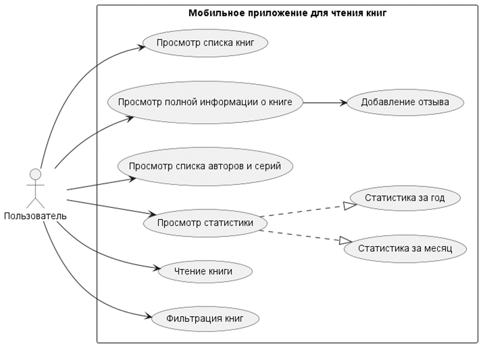
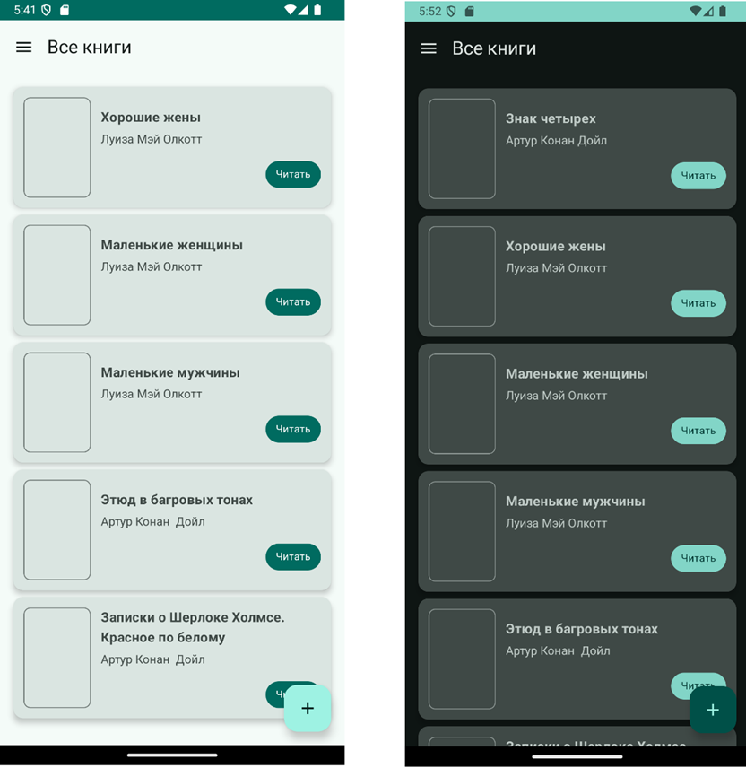
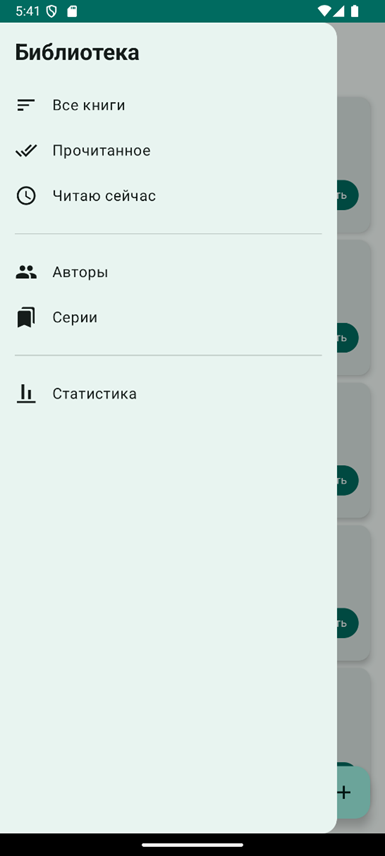
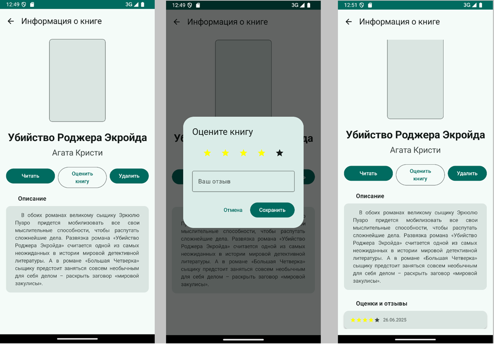
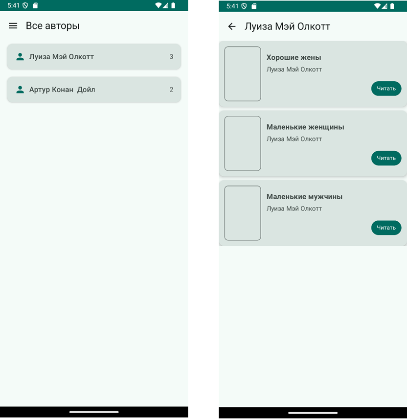
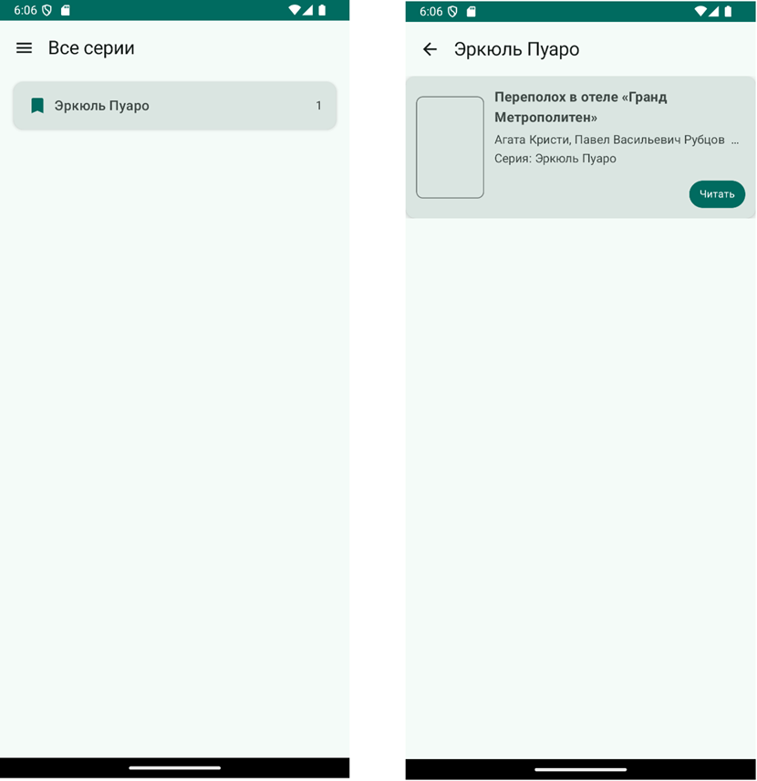
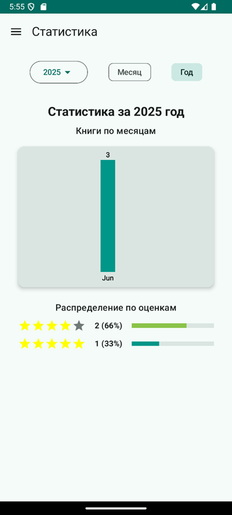

# Мобильное приложение для чтения электронных книг под операционную систему Android

**Используемые технологии:**
- язык программирования ***kotlin***
- ***Jetpack Compose***
- база данных ***SQLite***
- библиотека для работы с базой данных ***Room***

**Основные функции приложения представлены на диаграмме ниже**

## Интерфейс приложения
*Главная страница*

*Меню приложения*

*Страница с подробной информацией о книге*

*Режим чтения*

*Страница авторов*

*Страница серий*

*Статистика за месяц*

*Статистика за  год*

